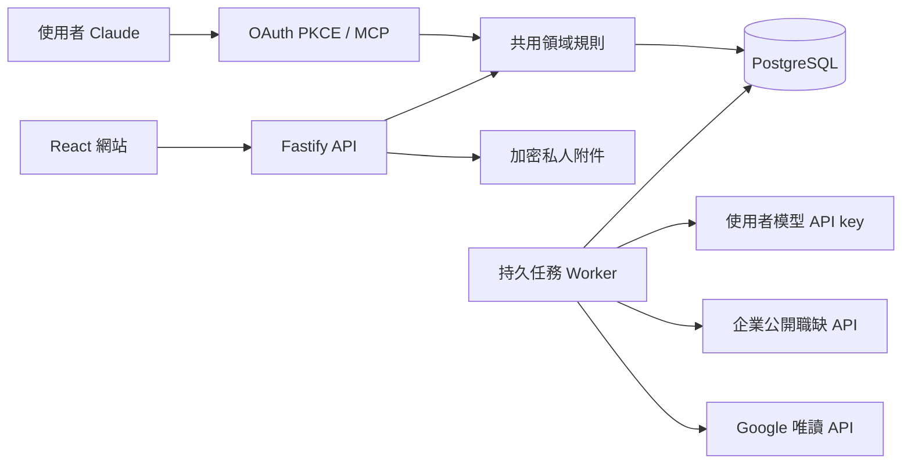

# CareerOS

私人求職工作台：經驗資料庫 → 多版履歷 → 職缺池 → 申請紀錄 → 面試、面經與 offer。繁體中文介面，支援中文／英文履歷、台灣／美國／國際職缺分類，以及邀請制小組。

**發布定位：可部署、邀請制的第一版；尚未通過自動投遞與跨主機災難復原驗收。** 不應把架構規格中的未完成能力當成已上線功能。實際交付範圍與限制見下表及 [部署文件](docs/DEPLOYMENT.md)。

| 功能 | 目前實作 |
|---|---|
| 經驗庫 | 文字、Markdown、PDF、DOCX、錄音原始素材；AI 草稿經本人確認；不可覆寫的 career revision；Markdown 匯出 |
| 履歷 | 同一份經驗生成多種方向、中英文、職缺客製；每段引用 fact ID；手動核對文字；新版本另存；固定 PDF／DOCX／Markdown 匯出 |
| 職缺 | Greenhouse／Lever 指定公司公開職缺、Arbeitnow；關鍵字與市場篩選；任何平台可手動貼上描述／網址；私人分類 |
| 申請 | 草稿、指定履歷、準備快照、手動確認已投遞、事件紀錄；不把準備完成當成已送出 |
| 面試與 offer | 正式邀請／輪次／改期；準備與正式面試分開；文字與附件面經；offer 條件版本、期限與本人決定 |
| 小組 | 單次邀請、共用職缺池、自己的未投／準備狀態、選擇性進度分享、文字面經快照、討論、撤銷與成員管理 |
| 自有 Claude | Remote MCP + OAuth 2.1 PKCE；讀取資料、生成任務、保存草稿、提議狀態；網站確認權限不交給 MCP |
| BYOK | 使用者 Anthropic key 進行文字生成；OpenAI key 轉錄最多三分鐘音訊；每日 token 預留、費用未知不自動重跑 |
| 職涯導航 | 根據固定的最多 20 份已保存職缺樣本，提供方向、證據缺口與學習任務；不把缺資料當成缺能力，不宣稱具備未確認技能 |
| 信箱／日曆 | Google 唯讀整合程式已實作；需營運者提供 OAuth 設定與通過所需驗證，目前未連接真實帳戶。定期同步為待確認訊號，不自行宣稱面試／offer |
| 自動送出 | **未實作／未啟用。** 需要站點 adapter、獨立 submission journal、恢復對帳及使用者規則驗收，不能只改一個環境變數開啟 |
| 備份 | 加密本機備份腳本、刪除 ledger 與還原程序；跨主機私有 bucket 依使用者要求延後 |

沒有內建假職缺、假投遞成功或共享平台模型金鑰。Claude 訂閱不等於網站可免費呼叫 Anthropic API；MCP 任務需要使用者在自己的 Claude 對話啟動。MCP 也不會自行監看使用者硬碟檔案或讀取未授權的對話。

## 架構



單機 Docker Compose：PostgreSQL 17、Node.js 22、獨立網站與 worker；前置 nginx 提供 HTTPS。沒有將其他使用者的履歷或經驗傳給模型的共用檢索庫。工作狀態、配额與確認以資料庫為準，UI 和 MCP 共用同一套領域服務。

## 啟動

需要 Docker / Docker Compose、Node.js 22+（本機開發）。

```bash
cp .env.example .env
# 填入 PUBLIC_URL、DATABASE_URL、POSTGRES_PASSWORD。
# ENCRYPTION_KEY 使用 openssl rand -hex 32；BOOTSTRAP_TOKEN 使用強隨機值。
docker-compose build web
docker-compose up -d db
docker-compose run --rm web npm run migrate
docker-compose up -d web worker
```

第一個帳號必須使用 `BOOTSTRAP_TOKEN`，之後採單次工作台邀請碼。不要將 `.env`、密鑰、備份或真實履歷提交到 Git。

本機開發：啟動 PostgreSQL，設定環境變數後 `npm ci && npm run migrate && npm run build && npm start`，另一個程序執行 `npm run worker`。Vite 開發服務使用 `npm run dev:web`。

若不使用 Docker，還需安裝 Playwright Chromium（`npx playwright install --with-deps chromium`）、CJK 字型、FFmpeg 與 Poppler 的 `pdftotext`；容器已包含這些文件匯出、語音解碼及 PDF 解析依賴。

## 驗證

```bash
npm ci
npm run build
npm test
# Linux Docker 主機，建立獨立 careeros_test，絕不清除正式資料
bash scripts/test-remote.sh
```

整合測試覆蓋 session / CSRF、多租戶存取、事實撤回、不可變版本、idempotency、事件去重、準備與面試分離、offer 終態、小組撤銷、真實 MCP SDK 連接、PKCE／refresh reuse／scope，以及 PDF／DOCX 固定下載。瀏覽器流程見 `tests/browser.ts`。

三位虛構人物、六版履歷的真實 HTTP MCP／瀏覽器完整驗收，包含資源限制、隔離資料庫與測後清理，見 [MCP E2E 操作文件](docs/MCP_E2E.md)。

## 文件

- [System design](docs/SYSTEM_DESIGN.md)、[contracts](docs/SYSTEM_CONTRACTS.md)、[原始驗收計畫](docs/IMPLEMENTATION_PLAN.md)：完整目標架構；不代表每項已交付。
- [獨立設計 review](docs/SYSTEM_DESIGN_REVIEW.md)、[實作 review](docs/IMPLEMENTATION_REVIEW.md)。
- [部署、備份與恢復](docs/DEPLOYMENT.md)、[待辦與上線門檻](docs/TODO.md)。
- [ApplyPilot 等專案研究](docs/RESEARCH_AND_PLAN.md)：本專案獨立實作，沒有直接複製 ApplyPilot 的投遞程式。

主要技術參考：[MCP TypeScript SDK](https://github.com/modelcontextprotocol/typescript-sdk/tree/v1.x)、[Greenhouse Job Board API](https://developers.greenhouse.io/job-board.html)、[Lever Postings API](https://github.com/lever/postings-api)、[OpenAI speech-to-text](https://developers.openai.com/api/docs/guides/speech-to-text)。
