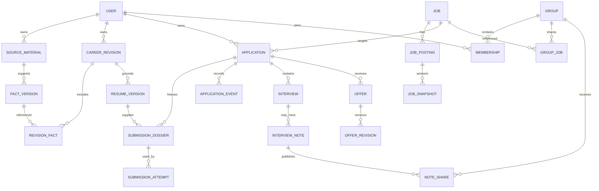

# CareerOS 資料、API 與 MCP 契約

版本 1.1；配套 [SYSTEM_DESIGN.md](SYSTEM_DESIGN.md)。本文件為實作契約草案，已納入獨立 review 修正；不是已產生 migration 或可呼叫的服務。所有範例 ID、時間與內容為示意。

## 1. 共用型別與資料隔離

ID 使用 opaque UUID；時間為 UTC timestamptz，另保留使用者／事件 IANA timezone；日期不明時保存原精度，不轉成假的月初。金額用 decimal＋currency＋period，不用 float，不直接把台幣月薪和美元年薪相加。

私有表必有 owner_id，API 從 session／validated OAuth token 設定 actor；輸入 schema 不接受任意 owner_id。引用其他私有表用 `(owner_id, id)` 複合外鍵。Worker 使用由 server 簽發、綁定 task_id／owner／purpose 的短效 capability，不能自行換 tenant。Group 表使用 group_id＋active membership＋內容作者／share ACL；owner_id 不被 group_id 替代。

核心 command 介面：`execute(command, actor_context, idempotency_key, expected_version)`。讀寫授權、schema、狀態轉移、budget、audit 均在 domain 執行；Web 與 MCP adapter 不實作另一套規則。跨使用者資源查詢回 404；本人的過期狀態回明確 domain error。

actor_context 的 credential_kind（website_session／delegated_mcp／service_capability）由驗證 middleware 推導，不能接受 request body 自稱 website。僅網站可執行的 confirm／decision 命令，即使從 HTTP route 用 MCP bearer token 呼叫也拒絕，不能只在 tools/list 隱藏它。

## 2. 概念 ERD



圖省略許多 supporting tables；實際一個 fact 可有多個來源，使用 fact_source 關聯，不受圖中簡化的單邊關係限制。Interview note 可先不綁 interview/application；補登後才連結。Offer 不要求先有 interview。

## 3. 資料字典與約束

| 實體 | 關鍵欄位 | 版本、權限與唯一性 |
| --- | --- | --- |
| users / user_settings | auth_subject、locale、timezone、AI mode、default limits | auth_subject unique；偏好可修改，政策另版本化 |
| source_material / asset | owner、kind、object_key/version、sha256、MIME、scan_state、retention_until | quarantine 與可下載狀態分離；object owner 和所有引用 owner 一致 |
| transcript_revision | source_id、segments/text、revision、language、provider | 原錄音與修正文稿獨立；unique(source_id, revision) |
| career_fact / fact_version / fact_source | fact_id、payload、assertion_type、confirmation、source spans | version 不覆寫；`confirmation=proposed/user_confirmed/withdrawn`；支持來源可多筆 |
| career_revision / revision_fact | owner、revision_no、parent、fact_version IDs、created_by | unique(owner, revision_no)；整份資料版本固定 |
| markdown_revision | career_revision_id、content、sha256、format_version | 對應同一 revision 的可讀投影；外部修改先進 proposal |
| profile_proposal | base_revision、operations、source IDs、conflicts、state | 確認時 optimistic lock；模型候選不直接寫正式事實 |
| resume / resume_version / resume_block | direction、locale、career_revision、blocks、fact_versions、status、hash | 每 block 保存 claim 支持與確認；eligibility 由 domain 計算 |
| dependency / validity_event / owner_eligibility | fact/block/answer refs、valid_from/until、withdrawal/correction、epoch | immutable 內容的當下資格另存；permit 直接查依賴與有效期，不只信快取 |
| rendered_document | resume_version、format、template_version、asset_id、hash、state | unique(resume_version, format, template_version, render_revision)；不覆寫已投版本 |
| generation_request | purpose、input_refs/hashes、mode、lease、candidate/result、state | snapshot 及預算固定；回傳 stale 時不能更新原先 pointer |
| search_preferences / search_run | filters、market、provider capabilities、input_version、results | 每 run 保存當时條件、來源成功／失敗与時間 |
| job / job_posting / job_alias | visibility、owner/group、employer、requisition、canonical identity | public/owner/group 範圍不同；私有 alias 不公開暴露 |
| job_snapshot / job_requirement | posting_id、content/hash、requirements、source spans、fetched_at | snapshot 不覆寫，original_url 與 apply_url 各自保存 |
| job_collection / collection_job | owner、label、job_id、saved/skipped | unique(collection_id, job_id)；進度 join 本人 application |
| application | owner、job_id、cycle_no、origin、current projection、version、submitted_at | unique(owner, job_id, cycle_no)；同公司不同 job 不合併 |
| submission_dossier | application、job_snapshot、resume_version、document asset/hash、answer snapshot、hash | immutable；建新 dossier 使舊的未消耗單次授權失效 |
| answer_question / answer_version | original wording、semantic_id、polarity、schema、value/units、scope、source、confirmed_by、valid_until | 版本不可覆寫；預設本申請；國家／雇主／職缺、條款版本、有效性皆需相符才重用 |
| submission_authorization | actor、kind、dossier_hash 或 policy_version/epoch、recovery_epoch、expiry、revoked_at | 單次／批次只對指定 hashes；規則按即時條件驗證；恢復前 epoch 的授權不復活 |
| submission_policy / policy_version | active_version、authorization_epoch、user conditions、facts/blocks allowlist、daily cap、budget、timezone、expiry | 每 policy 一個 active version；發布／暫停提升 epoch，舊授權失效；不同 policy 共享帳戶總額度 |
| submission_attempt / submission_intent | dossier、status、runner、lease generation、permit、provider receipt、recovery_epoch | 同 application 至多一個未結案 intent；任何有效已投事件均阻止同 cycle 新 intent；permit CAS 一次 |
| recovery_blocker / journal_projection | stable account ref、job identity/cycle、intent、dossier hash、epoch、journal ref、state | 獨立 journal 的 DB 投影；還原時先重建，missing evidence 不能當 safe retry |
| evidence / external_message | owner、connection、provider id、version、snippet、asset、event_time | unique(connection, resource_id, provider_version/content_hash)；重分類不重收 |
| evidence_signal | evidence refs、type、application candidate、confidence、rule/model version、review state | candidate 不是事件；推論保留未確定欄位，不捏造 submission |
| manual_event_proposal / answer_proposal | owner、exact payload/hash、proposed_by、evidence refs、base_version、state | MCP 提案不入統計；網站核對內容後以專用 command 發布，不能用任意 confirmed=true |
| application_event | owner、application、type、payload、source、occurred_at、recorded_at、seq、supersedes | append-only（正常操作）；unique(application, seq)、source_event_key unique scoped to source |
| projection_override | application、field_path、value、source event、locked、version | 手動更正可以鎖定；明確解除或使用者確認較新證據才替換 |
| interview / interview_revision | application、round_id、invited/scheduled/completed/cancelled、start/end、timezone | 改期保留歷史，external event mapping 唯一；不要求有 submitted_at |
| interview_preparation | owner、optional application/interview、goals、session notes | 可練習尚未申請的公司；不參與獲邀統計 |
| interview_note / note_revision | owner、optional interview、original asset、summary、questions、feedback_kind | AI 摘要與原文分開；主觀觀察不當面試官原話 |
| offer / offer_revision | application、received_at、evidence_kind、currency、pay_period、terms、decision | 同 offer 改條件新 revision；decision 只能本人有效命令更新 |
| group / membership / invitation | roles、active、token_hash、expiry、usage limits | unique(group, user)；invite 消耗交易；群組 owner 至少一人直到關閉 |
| group_job / group_comment | group、job/shared snapshot、author、body | group ACL；個人投遞狀態不寫入 group_job |
| group_sharing_preference / note_share | owner、group、allowed fields、snapshot、attachment allowlist、revoked_at | 分享只限本人資產；原文更新不自動公開 |
| occupation / skill / taxonomy_edge | source、external_code、locale、release_version、alias | 保存來源及版本；地區與職類映射可標不確定 |
| data_source / dataset_release | source_url、license/provenance、market、release、retrieved_at、refresh_policy | 未核定使用方式者不能進批量 ingestion |
| career_analysis / recommendation / growth_task | career revision、sample snapshot、evidence IDs、gap state、outputs | recommendation 是建議；完成任务後另提 fact proposal |
| integration_connection / sync_cursor | owner、provider、scopes、secret ref、cursor、expiry、last_success、state | 每 provider account 對應本人；cursor 與 ingest 完成同交易 |
| oauth_grant / secret_ref | owner、client、scopes、expiry、revocation、encrypted locator | 不保存可在 UI/MCP 讀回的原 key；供應商憑證與 MCP grants 分開 |
| background_task / task_step / outbox | type、owner、input refs、state、lease、checkpoint、retry、event_id | durable，at-least-once；external submit 步驟不可一般自動重試 |
| usage_reservation / usage_entry | owner、task、category、provider_request_id、estimated/actual、currency、state | provider_request_id 去重；reservation 持有至結算／查明 |
| idempotency_record / audit_event / deletion_ledger | actor、operation、key/hash、response_ref、expiry / redacted fields | 普通寫操作 key 至少 7 天；submit intent／外部事件 key 依申請生命週期保留 |

DB 之外另保存 recovery control epoch/gates 與 append-only submission journal；不能把兩者都放進同一 PITR 後聲稱已獨立。Journal 僅含最小 refs、hash、受保護 job identity、時間、epoch、結果指標，無原文／秘密；加密及帳號刪除規則適用。Dossier manifest／實際文件在私人 object storage 保存 immutable version，供恢復引用。

deletion_ledger 在 DB 中只是投影；具權威性的最小 deletion tombstones／高水位保存在 DB 恢復範圍之外。還原完成先比對並重播刪除、清分享／索引／快取，再開讀取 gate（含網站、MCP、asset download、workers）；ledger 不可用或高水位不明時保持受影響範圍隔離。Tombstone 保存至其可覆蓋的備份／重播來源淘汰，不能包含已刪原文。

應建索引：`applications(owner_id, submitted_at, id)`、`application_events(application_id, seq)`、`tasks(state, next_run_at)`、`tasks(owner_id, created_at)`、`evidence(connection_id, resource_id)`、`memberships(group_id, user_id, active)`、`job_postings(provider, external_id, visibility_scope)`、`job_requirements(job_snapshot_id)`；常見列表用 keyset pagination，避免無限 offset。全文索引區分中文斷詞／英文及原詞 fallback，需以兩市場資料驗證，不能只預設英文 stemming。

### 申請 identity 與合併

預設 cycle_no=1。只有使用者確認新的招聘週期且舊流程已結束才可開 cycle 2，留 reason；不能為繞過重複防護自動加 1。不同外部 posting 一旦確認同 canonical job，先查雙方 applications；有活動 intent 時禁止直接合併，先停止尚未提交的任務並查證。若已有兩份實際提交，保留兩次 attempts/evidence，合併成同一邏輯申請並標記 duplicate_submission；不刪除歷史，不將這件事隱藏成「只有投一次」。來源 URL 的私人 token 不進公共 alias／log。

## 4. 分離的狀態模型

| 實體 | 狀態 | 註記 |
| --- | --- | --- |
| 通用 task | queued/running/waiting_user/waiting_client/waiting_budget/succeeded/failed/cancelled | waiting_reason 說明需重連、補答或新授權；failed 可保存部分結果 |
| fact proposal | proposed/conflicted/accepted/rejected | accepted 發布新的 career_revision |
| resume version | draft/needs_review/validated/render_failed/ready | ready 不代表 auto_apply_eligible，兩者分開 |
| attempt | queued/preparing/needs_input/ready/submitting/outcome_unknown/reconciling/needs_review/confirmed/failed_safe/cancelled | outcome_unknown 不能自動 queued |
| application projection | preparing/submitted/interviewing/offer/closed | closed_reason 為 rejected/withdrawn/offer_declined/offer_expired/offer_withdrawn/accepted |
| interview | invited/scheduled/completed/cancelled | 無日期邀請合法；cancelled 不代表 application rejected |
| offer | received/accepted/declined/expired/withdrawn | 收到、決定與修訂分開；過期依可信期限且未覆蓋 accepted |
| connection | active/degraded/needs_reauth/revoked | 保留 last_success，不把 revoked 假裝同步成功 |

Application projection 從有效事件、各 round／offer 聚合而來；不是單一單向階梯。Interview 被取消不等於拒絕；offer withdrawn 與本人 withdrew application 不同；一份 offer 過期而另一份有效時仍是 offer。無法一致聚合時標 `requires_review` 與原因。事件明確更正可使 projection 回到較早階段。

事件 envelope 範例：

```json
{
  "event_id": "evt_example",
  "schema_version": 1,
  "application_id": "app_example",
  "type": "interview.invited",
  "source": {"kind": "gmail", "connection_id": "conn_example", "external_event_key": "message:123:invite:round1"},
  "occurred_at": "2026-09-18T17:00:00Z",
  "recorded_at": "2026-09-18T17:02:00Z",
  "evidence_ids": ["evidence_example"],
  "payload": {"round_id": "round_example", "scheduled_start": null},
  "supersedes_event_id": null
}
```

owner、seq、recorded_at、可信 source.kind 由 server 填入；客戶端不能冒充 Gmail 或 runner。網站本人補登產生 user_reported，MCP 的 `applications.propose_manual_event` 和 adapter 的候選訊號不直接發布事件；已登記 adapter 身分才可提交其來源 evidence。不能只靠可偽造的 `success=true` 或截圖 OCR 就確認外部投遞。

以上來源規則以以下 actor 白名單為準；**MCP 不再提供可直接發布事件的 applications.record_manual**，取代為 applications.propose_manual_event。

| Actor / channel | 可以發布或提案 | 不能繞過的限制 |
| --- | --- | --- |
| MCP client | proposed manual submission、interview invitation／update、offer received／terms、rejection／withdrawal／correction，及 answer proposals | 只存候選；不改 authoritative projection／統計；拒絕 offer decision、policy/share/account-deletion event types |
| 網站本人明确補登／確認 | submitted、invited／scheduled／completed／cancelled、offer received／terms、application rejected／withdrawn，來源 user_reported | 必須顯示確切 payload，驗證 session、CSRF、expected_version；確認候選绑定其 hash；不得任意冒充 adapter |
| 網站本人 offer decision command | offer accepted／declined | 專用 endpoint，當前 offer revision＋明確決定；generic manual/correction route 不接受 |
| 登記的 runner evidence handler | confirmed submission／unknown／failed_safe proposals | 符合 intent／permit／來源證據才能由 domain 發布；runner 無任意 event 權限 |
| 同步 adapter／classifier | signal proposals | 只有已啟用、通過評估的伺服器判定規則可發布對應 invitation/update/offer received/rejection；永不接受 offer |
| Scheduler | 到期、任務狀態、sync／reconcile | 無送出證據不得發 submitted；expiry 不可覆蓋已 accepted |

拒絕未列出的 event_type，而非把它當 generic payload 保存成權威事件；scope read/write 不會扩大上表。網站 correction 同樣不能改寫 policy、ACL、offer decision 或抹掉提交鎖；更正「實際未投」會 invalidates 原記錄，但只有獨立的未送出證據審核能解除 submit blocker。

## 5. HTTP API

API 前綴 `/v1`，bearer／session 分開處理。GET 不改狀態；PATCH 使用 If-Match；寫操作 Idempotency-Key；長任務 202＋task_id／status_url。下列為主要 route family，實作時產生 OpenAPI 與共用 schema，不能只做無驗證泛用 CRUD。

| Route | 用途 |
| --- | --- |
| `POST /assets/upload-intents`、`POST /assets/:id/complete`、`GET /assets/:id/download` | 綁定 owner/type/size/hash 的上傳、掃描完成後存取 |
| `POST /sources`、`POST /sources/:id/transcribe` | 新素材及獨立轉錄任務 |
| `GET /career`、`POST /career/proposals`、`POST /career/proposals/:id/confirm` | 經驗讀取、proposal、確認發布 |
| `GET /career/markdown`、`POST /career/markdown-imports` | 匯出／三方合併候選 |
| `POST /generation-requests`、`GET /tasks/:id`、`GET /tasks` | 網站與 MCP 共用生成任務與進度 |
| `GET /resumes`、`POST /resumes/:id/versions`、`POST /resume-versions/:id/validate`、`POST /resume-versions/:id/render` | 多版本、資格驗證與文件匯出 |
| `POST /search-runs`、`POST /job-imports`、`GET /jobs`、`GET /jobs/:id` | 外部搜尋、來源匯入、已索引資料查詢 |
| `POST /collections`、`POST /collections/:id/jobs` | 本人職缺分組 |
| `POST /applications`、`GET /applications`、`GET /applications/:id` | 建立／看板／詳情；建立不代表已投 |
| `POST /applications/:id/prepare`、`GET /dossiers/:id` | 固定當次版本並產出 review |
| `GET /answers`、`POST /answer-proposals`、`POST /answers`、`POST /answers/:id/revoke` | 本人網站確認的版本化答案庫；MCP 只能提案；撤回使依賴資格失效 |
| `POST /tasks/:id/answers` | 網站補答，expected_task_version＋question hash＋answer/version＋reuse scope＋idempotency key；驗證後續跑 |
| `POST /submission-authorizations`、`POST /submission-policies` | 網站建立單次／批次／規則授權，需本人有效 session 與 review context |
| `POST /applications/:id/submit`、`POST /attempts/:id/cancel`、`POST /attempts/:id/reconcile` | 依有效授權執行、停止未送出、查證 |
| `POST /applications/:id/manual-events`、`POST /applications/:id/corrections` | 明確補登／更正，不偽裝 provider 來源 |
| `POST /manual-event-proposals/:id/confirm`、`POST /offers/:id/decisions` | 網站確認精確補登候選／專用 offer 決定，驗證 payload hash 與目前版本 |
| `GET /signals`、`POST /signals/:id/confirm`、`POST /signals/:id/dismiss` | 同步候選待確認 |
| `POST /preparations`、`POST /interviews`、`POST /interview-notes`、`POST /offers` | 面試練習、真實面試、面經、offer 分離 |
| `POST /groups`、`POST /groups/:id/invitations`、`POST /invitations/:token/accept` | 小組與有限邀請 |
| `PUT /groups/:id/sharing`、`POST /notes/:id/shares`、`DELETE /note-shares/:id` | 本人分享欄位／快照、撤銷 |
| `POST /career-analyses`、`POST /growth-tasks/:id/completions` | 證據式建議、完成任務提事實候選 |
| `POST /connections/:provider/start`、`DELETE /connections/:id`、`GET /connections` | 獨立 provider OAuth 與撤銷 |
| `POST /ai-credentials`、`GET /usage`、`PUT /budgets` | 只寫秘密、查記帳、設定額度 |
| `POST /exports`、`POST /account-deletion-requests` | 可下載資料匯出及受保護的永久刪除流程 |

HTTP 401 未驗證；403 scope／政策不足（僅本人可見資源）；404 不存在或無權看；409 revision/idempotency/state conflict；422 schema/unsupported evidence；429 限流／併發；503 provider 不可用。需補答可用成功的 domain response 返回 waiting 狀態，不用 500 表示正常流程。

## 6. MCP 工具契約

使用符合已實測版本的官方 SDK 包装 JSON-RPC。下表為 domain tool，不硬寫協定 transport envelope；所有 output 有 structured schema，文字摘要僅輔助。列表分頁預設 20、最大 100；不一次傳整個人生資料庫／信箱，按事實與 evidence refs 取需要的範圍。

| Tool | 關鍵輸入 | 關鍵輸出／限制 |
| --- | --- | --- |
| `profile.get` | revision?、sections? | current revision、已授權 facts 與來源摘要 |
| `profile.propose_changes` | base_revision、operations、source_ids、idempotency_key | proposal_id、diff、conflicts、review_url；不能自認 user_confirmed |
| `profile.export_markdown` | revision | authenticated resource／下載入口；不承諾監看本機檔案 |
| `sources.create_text` | text、kind、title、idempotency_key | source_id；上傳二進位另取 upload intent |
| `generation.list_pending` | cursor、purpose? | 本人待 Claude 處理任務 |
| `generation.get_context` | request_id | 固定 revisions/hashes、claim_token、必要 facts/JD、輸出 schema |
| `generation.submit_result` | request_id、claim_token、input_hash、candidate、idempotency_key | accepted/needs_review/stale/invalid；只存候選不直接宣稱成功 |
| `resumes.list`／`resumes.get` | cursor／resume_version_id | 版本、支持證據、文件 refs、eligibility |
| `resumes.create_version` | base_version?、career_revision、job_snapshot?、blocks＋fact_version IDs、language、key | version_id、validation issues；與網站相同驗證 |
| `resumes.render` | version_id、format、key | task_id；純 renderer 不再花 LLM 費用 |
| `jobs.search` | filters、market、cursor 或 search_run_id | 已索引結果；要外部搜尋明確 start_search_run，避免讀操作暗中花額度 |
| `jobs.start_search_run` | providers、filters、key | task_id、capabilities、部分來源失敗資訊 |
| `jobs.import` | text 或 public URL、visibility、key | job_id、snapshot、unsupported/needs_review |
| `collections.add_job` | collection_id、job_id、key | 本人收藏關係，無投遞副作用 |
| `applications.prepare` | job_id、resume_version、answer refs、key | application_id、dossier hash、issues、review_url |
| `applications.submit` | application_id、dossier_hash、authorization_id、key | attempt_id、task_id；重新驗證授權／quota，202 不表示已投 |
| `applications.list`／`applications.get` | filters／application_id | 真實事件、文件與統計；無任意 user_id |
| `applications.propose_manual_event` | job_id/application_id、白名單 event_type、occurred_at?、evidence refs?、key | proposal_id＋review_url；未確認不計統計，不得傳 offer decision 或偽裝 provider |
| `answers.propose` | task/question ref、question hash、value/units、requested reuse scope、source refs、key | 待本人確認的 answer proposal；模型不得自行扩張重用範圍 |
| `preparations.create` | job/application?、goal、notes、key | preparation_id，不產生面試邀請 |
| `interviews.propose`／`offers.propose` | application?、details、evidence refs、key | 待確認候選；accept offer 不提供自動決定工具 |
| `notes.save` | text／asset refs、application/interview?、key | 私人筆記；分享需獨立網站設定 |
| `career.get_evidence` | target role、market、sample filters、revision | sample manifest、requirement evidence、taxonomy refs；有資料權限限制 |
| `career.save_plan` | input hash、recommendations、evidence IDs、tasks、key | 驗證來源後存草稿，unsupported claims 標示 |
| `groups.list`／`groups.get_jobs` | cursor／group_id | 僅目前 membership 可見的共享欄位 |
| `tasks.get`／`tasks.cancel` | task_id、key? | checkpoint／結果；取消不能聲稱撤回外部申請 |

MCP 回應不得帶 provider key、站點 cookies、群組成員 private application IDs、未分享文件或無限制外連。Tool scope 可逐項開啟；grant 撤銷後所有新的讀寫拒絕，正在跑的 task 另看其自身授權是否也已撤銷，網站提供「斷開 AI」與「停止全部自動化」分開且清楚的操作。

## 7. 三個必要契約範例

### A. 同一寫操作重試

```json
{
  "application_id": "app_example",
  "dossier_hash": "sha256:example",
  "authorization_id": "auth_example",
  "idempotency_key": "client-generated-unique-key"
}
```

Server 由 actor＋command＋key 建立唯一 record，對 request 做 canonical hash；同 key 同 body 回同 attempt/task ref，同 key 不同 body 回 IDEMPOTENCY_CONFLICT。任何新 key 都先在 application lock 內查整個 cycle 的有效 submitted/confirmed/本人已確認補登：有則回 ALREADY_SUBMITTED，包含 interviewing／closed 的申請；有 unresolved attempt／recovery blocker 回 OUTCOME_UNRESOLVED；再檢查 active intent。只有 failed_safe 的證據確認或本人開立新的招聘 cycle 才可取得新的意圖，不依 projection 單欄或短效 cache 判斷。

### B. 生成任務的版本衝突

```json
{
  "request_id": "gen_example",
  "status": "needs_review",
  "input": {"career_revision": 12, "job_snapshot_id": "js_example", "input_hash": "sha256:example"},
  "result_ref": "resume_version_example",
  "warnings": [{"code": "NEWER_CAREER_REVISION", "current_revision": 13}],
  "next_action": {"type": "review", "url": "/resumes/resume_version_example"}
}
```

revision 12 的內容仍可保存為該版本，但不能改成聲稱使用 revision 13，也不能覆蓋最新工作草稿。claim_token 為 owner/request/input_hash 限定的隨機租約；過期回 STALE_CLAIM，可再讀取／認領；已完成任務回原結果。第二份不同結果不覆蓋第一份，使用者可明確另開 generation_request。

### C. 提交结果不明

```json
{
  "attempt_id": "attempt_example",
  "status": "outcome_unknown",
  "counted_as_submitted": false,
  "can_retry_submit": false,
  "reason_code": "CONNECTION_LOST_AFTER_SUBMIT_PERMIT",
  "next_action": {"type": "reconcile", "task_id": "reconcile_example"}
}
```

LLM 不得把 `can_retry_submit=false` 改成 true 後再呼叫；submit handler 從 DB 重新檢查，不信任客戶端布林。

## 8. 交易與併發邊界

1. Career confirmation：鎖 current revision → check expected version → 保存 fact versions／revision／Markdown／event/outbox → commit。
2. Dossier authorization：只接受經驗／文件已就緒；固定 bytes hash、問題答案、JD、policy version。單次授權變更任何綁定內容即失效。
3. Submit permit：先建 durable intent，寫獨立 journal 並取得 ack（不持 DB 長交易）→ 依固定順序鎖 owner eligibility、policy、application、adapter account → 驗證 journal ack／recovery epoch＋gate、最新依賴資格、authorization 對上 policy.active_version/epoch、有效已投／unresolved blockers、quota、lease → CAS permit → commit。Journal 先寫而 permit 未發出的意圖可保守待查；ack 不能取代 transaction 中的當下權限檢查。外部提交在交易外且不得一般重試。
4. Evidence ingest：以 connection/external key 去重 → 保存 bounded batch → outbox → 推進到該 batch 完成 cursor。分頁中斷可重放。
5. Event projection：鎖 application version → 驗證 source／evidence → 分配 seq → append event → 更新 projection/version → outbox。重算不得重送外部副作用。
6. Group share revoke：membership/share version 更新 → projection／cache invalidation；讀取也檢查最新有效性，不只依失效訊息。
7. Usage：鎖 owner/category/window budget → reservation → call → usage_entry 去重结算；timeout 保留 unresolved reservation。
8. Policy publish/revoke：鎖 owner/policy → 替換 active_version、提升 authorization_epoch → 使舊未消耗授權失效／重評估未提交 dossiers → outbox。已跨 permit 的工作只查結果；並行的 publish 與 permit 以 lock commit 先後為界。
9. Fact/answer validity：同 owner eligibility lock 內 append withdrawal/correction／effective_until 變更並提升 epoch；permit 查真實依賴和當下時間，不能等背景 fan-out 才生效。未引用該變更的 dossier 可以重新驗證繼續；被撤回的現存 bytes 不改寫，但不能取得新 permit。
10. Recovery：先在不還原的 control plane 關閉 gates／換 epoch、隔離舊 runner，再恢復 DB；由 journal 重建包括遺失 applications 在內的 job/cycle blockers、intent 與投遞配額，所有政策先 suspended，所有舊 recovery_epoch 的單次／批次／規則授權失效，需本人網站重新啟用取得新授權。付費 AI 另依 provider usage／帳單對帳；有缺口就保守鎖額度，不能從 submission journal 猜回模型費用。逐帳戶核實外部結果、本人當前授權及預算後開 gate；沒有 journal 高水位則全域保持隔離，不能只把 ready 任務再排一次。

「每日上限」使用 policy 保存的 IANA timezone，DB 保存日窗 boundaries。送出前 reserve，confirmed 與 unknown 都占用防重配額；確定未送出的 failed_safe 可退還投遞筆數。嘗試頻率另限流，失敗不能無限免費重跑。修改 timezone 不重置正在使用的日窗以繞過上限。

答案匹配 key 至少包括 semantic_id、polarity、response schema、country、employer/job 限制與 question/terms revision。模型可建議中英問題映射，未驗證映射不能自動重用。薪資保存原幣別與期間，轉換需明確規則並在 dossier 留轉換來源；法定聲明／同意問題不得只用 generic semantic_id。補答直接提交的是新的 answer_version，不覆寫既有 snapshots；更正或撤回與 fact 使用相同 eligibility 規則。

## 9. 版本化與相容性

REST `/v1`、event schema_version、tool input/output schema version、template、extractor/model policy、dataset release 都單獨保存。新增 optional 欄位向後相容，改語意／移除欄位需新版本。MCP 相容矩陣記錄真實 Claude client 版本、SDK、protocol、OAuth discovery、tools、resources、task polling 測試；不把 MCP 協定版本誤當產品資料版本。

前端 status enum 要處理未知值並顯示可恢復狀態，不因新增狀態崩潰。Outbox 和 sync event 需留舊版 decoder 至資料遷移完成；重放只重建 projection，不呼叫 submit、provider 或重寄通知。刪除 tombstone 必須在還原／重放時同樣生效。
