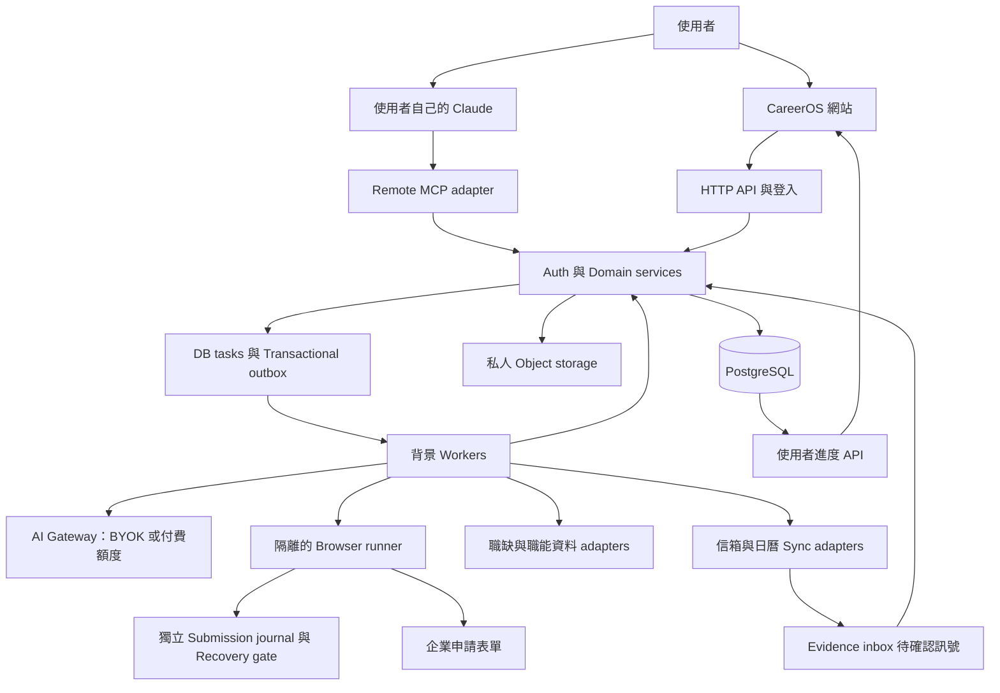
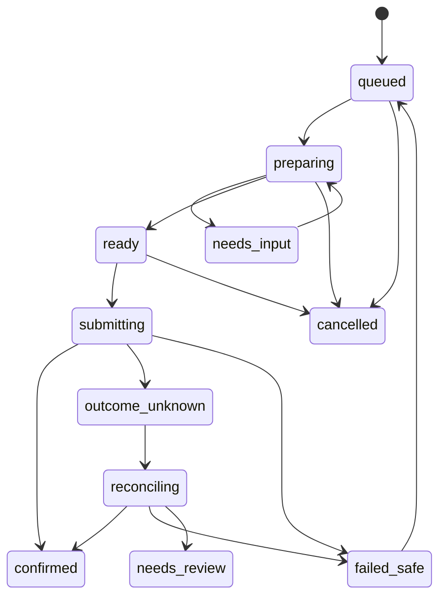
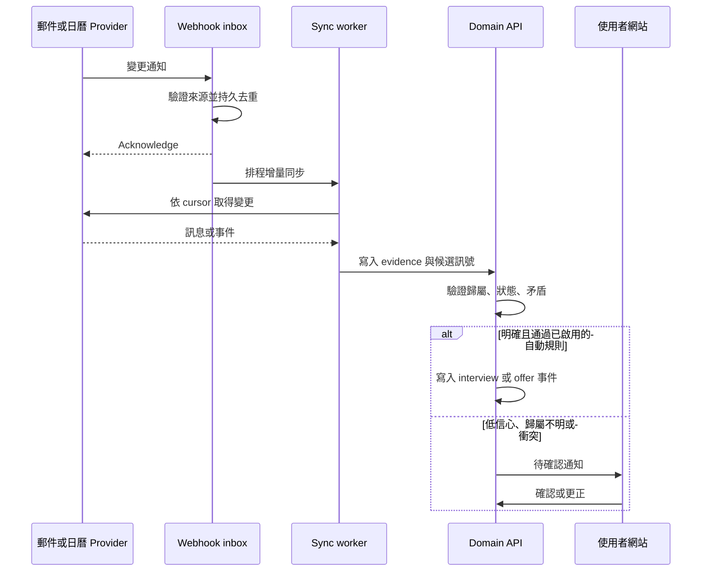

# CareerOS System Design

版本：1.1，2026-09-18（美西）。狀態：開發設計，已修正獨立 review 發現的契約缺口；尚未建置或完成正式環境驗證。

本文件整合既有的 [網站規格](WEB_PRODUCT_SPEC.md)、[群組規格](GROUPS_PRODUCT_SPEC.md)、[職涯資料方案](CAREER_GUIDANCE_DATA_PLAN.md) 與 [Figma](https://www.figma.com/design/jjl7ioOIAnBqsoKKW9AEvt)。資料、API 與 MCP 契約見 [SYSTEM_CONTRACTS.md](SYSTEM_CONTRACTS.md)，開發順序與驗收見 [IMPLEMENTATION_PLAN.md](IMPLEMENTATION_PLAN.md)，獨立審查見 [SYSTEM_DESIGN_REVIEW.md](SYSTEM_DESIGN_REVIEW.md)。後續實作以這組文件的明確規則為準；原型不是已完成的服務。

## 1. 系統決策摘要

CareerOS 是「個人職涯資料庫＋求職工作台＋受授權的執行器」。網站及使用者自己的 Claude 都可操作同一帳戶；所有可靠紀錄保存在 CareerOS 後端。MCP 是 AI 的入口，不是資料庫、排程器，也不會自動看到使用者的所有對話、電腦檔案或站外申請。

採用 **TypeScript 模組化單體 API＋獨立背景 workers**。先用 PostgreSQL 管理資料、全文／條件搜尋、任務與 outbox；私人物件儲存放文件；瀏覽器投遞在隔離容器執行。初期不引入微服務、獨立向量資料庫或訓練自己的模型。MCP 與 HTTP API 只是同一組 domain commands 的兩個 adapter，不能各自維護履歷與投遞狀態。

模型使用分成使用者 Claude 經 MCP、使用者 API key（BYOK）、未來選配的付費平台額度。**完整留在網站內的一鍵生成與無人值守的 AI 背景任務，需要 BYOK 或明確付費額度。**純 MCP 使用者仍有完整網站資料操作與任务進度，但生成步驟需在自己的 Claude 完成；UI 必須明示這項差異。

搜尋、投遞、面試同步逐來源開通能力。台灣與美國／國際都在產品範圍內，但「能讀取職缺」不等於「能自動投遞」。完整版發布需通過兩個市場的真實端到端流程；沒有接通的来源不能用展示資料代替完成。

## 2. 需求與不可破壞的規則

| 能力 | 前端操作 | 後端保證 |
| --- | --- | --- |
| 經驗庫 | 文字、錄音、上傳、整理、差異確認、Markdown 匯出／匯入 | 原始資料、候選事實、已確認事實、修訂分離 |
| 多版履歷 | 中英文、職類版本、按 JD 客製、比較、PDF／DOCX | 每項敘述追溯來源；歷史版本不可覆寫 |
| 找工 | 雙市場搜尋、條件、配對解釋、收藏、職缺分組 | 未知条件不當作符合；來源、版本、更新時間可查 |
| 投遞 | 草稿、批次、規則模式、補答、接手、暫停 | 有效授權、去重、可恢復、不因重試而重複送出 |
| 追蹤 | 申請時間軸、面試輪次、面經、offer、最終決定 | 試跑不是已投；練習不是面試邀請；修訂不是新 offer |
| 小組 | 共用職缺、討論、本人未投清單、面經分享 | 狀態依個人計算；私人資料及代投權限不因加入小組而共享 |
| 職涯導航 | 方向比較、缺口、證據、成長任務 | 無資料不等於不會；需求樣本與個人能力分開 |
| 自備 AI | 連 Claude、BYOK、預算、權限與斷線狀態 | 不使用訂閱 cookie 代付後台 API；不得靜默轉由平台付費 |

核心不變量：

1. 所有私人讀寫以已驗證的 actor 為準；模型提供的 user_id、文件 ID、group_id 不構成授權。
2. 生成履歷不得將 JD 的要求變成使用者已有的經驗；自由改寫的來源 ID 本身不構成事實驗證。
3. application、submission attempt、interview、interview preparation、offer 為不同實體。
4. 同一使用者、同一職缺、同一申請週期只有一個邏輯申請；每次執行及疑似重投有獨立 attempt。
5. 投遞數只計有送出證據或本人明確補登的申請；送出後狀態不明不得自動再按一次。
6. 歷史投遞永遠連到當次文件、答案與 JD 快照；一般編輯不能改寫歷史，正式刪除資料流程例外。
7. MCP、網站與同步 worker 都經相同驗證、狀態轉移、預算與審計規則。
8. 沒有來源、模型額度或自動化能力時呈現具體待處理原因，不偽裝成功。

不在第一版：訓練專屬模型、推算個人錄取機率、公開面經社群、招募方 ATS、替使用者回信或接受 offer、任意網站皆能投遞的保證。私人小組分享仍屬確定範圍。

## 3. 系統架構

箭頭為邏輯資料流；worker 使用內部 command handler／受限 service identity，不直接繞過 domain 寫資料。公網 webhook 入口只驗證訊息、持久收件、排入同步工作，不執行長任務。前端 SSE／輪詢是更新提示，重新讀取 API 才是完整狀態。

| 部分 | 建議選型與責任 | 明確邊界 |
| --- | --- | --- |
| Web | Next.js／React／TypeScript；表單、錄音、編輯器、看板、分享設定 | 不在瀏覽器存供應商長效 key；不靠頁面持續開啟跑任務 |
| API | TypeScript Node 常駐 container，REST `/v1`，共用 schema | 同步請求只做短交易，長工作返回 task_id |
| MCP | 官方 SDK 的 Streamable HTTP adapter，公開 HTTPS endpoint | 獨立驗證 OAuth，轉呼 domain；不替 Claude 執行無限推理 |
| Auth | 支援所選 MCP 客戶端的 OAuth 授權服務；網站使用安全 session | 先做真實 Claude 相容性 spike，再定供應商；不自行拼湊 OAuth |
| DB | Managed PostgreSQL、migration、PITR；SQL 條件與全文搜尋 | 私有資料 owner_id，重要關聯複合外鍵，RLS 作第二層隔離 |
| Files | S3 相容私人 bucket；隔離上傳區、掃描、校验、短效讀取 | 不允許公用文件 URL；分享附件另走即時授權代理 |
| Tasks | PostgreSQL 持久任務／租約＋outbox dispatcher | 至少一次交付；API 與事件同交易，不假設 queue 恰好一次 |
| Workers | ingest、render、search、sync、AI 任務各有 concurrency pool | 投遞 runner 與一般 worker 分離，避免一個瀏覽器耗盡全部任務 |
| Browser | Playwright，每位使用者獨立短生命週期 container／session | runner 無 DB 管理權，僅拿當次必要文件與短效權限 |
| Recovery control | 與 DB 恢復範圍分離的 epoch／submit journal，獨立故障域的加密版本化儲存 | journal 未持久化或 recovery gate 關閉時不發 submit permit |
| AI | Provider adapter＋輸入／輸出 schema＋用量記帳 | 提示詞不能凌駕 ACL；工具與預算在程式碼執行 |

建議 monorepo：`apps/web`、`apps/api`（包含 MCP）、`apps/worker`、`apps/browser-runner`、`packages/domain`、`packages/contracts`、`packages/connectors`、`packages/db`。這是待建立的結構，當前目錄只有規格與 Figma 輔助文件。

## 4. Claude、MCP、網站與費用

| 模式 | AI 推理在哪裡 | 網站可做什麼 | 關閉 Claude 後 |
| --- | --- | --- | --- |
| 自己的 Claude＋MCP | 使用者 Claude 對話 | 建任務、查看／修改資料、匯出、管理投遞與同步；生成任務可交回 Claude | 已有文件的匯出、deterministic 搜尋／同步／受授權投遞繼續；新推理等使用者回來 |
| BYOK | 後端以該使用者的 API key 呼叫 provider | 網站內完成全部生成與背景 AI 工作 | 在預算、有效 key 與既有授權內繼續 |
| 平台額度（選配） | 後端使用平台模型帳戶 | 與 BYOK 相同操作，顯示剩餘額度 | 在已購／明確允許的額度內繼續；預設關閉 |
| 無模型 | 無 | 手動編輯、上傳、匯出、紀錄／分組；已實作的規則搜尋與同步 | 不提供假的 AI 生成結果 |

Claude 訂閱與 API 計費是分開的；Remote MCP 讓 Claude 呼叫我們提供的工具，並不授予 CareerOS 任意呼叫使用者訂閱模型的能力。[Claude 計費說明](https://support.claude.com/en/articles/9876003-i-have-a-paid-claude-subscription-pro-max-team-or-enterprise-plans-why-do-i-have-to-pay-separately-to-use-the-claude-api-and-console)、[Remote MCP 說明](https://support.claude.com/en/articles/11175166-get-started-with-custom-connectors-using-remote-mcp)。

MCP 模式的網站生成流程：網站建立 `generation_request` → 顯示「待你的 Claude 處理」與任務編號／連接指引 → 使用者在已連接的 Claude 要求處理待辦 → `generation.get_context` 取得固定版本資料 → Claude 生成 → `generation.submit_result` 回傳候選結果 → domain 驗證 → 網站顯示差異與後續動作。這不是自動喚醒 Claude；不承諾通用的 Claude 預填 prompt 深連結。前端仍須顯示此任務的完整生命週期。

候選事實可由 MCP 建立，但模型不能單靠 `confirmed: true` 自我認證為使用者確認。新增數字、日期、職稱或技能先進待確認清單；網站確認後建立正式 revision。MCP 回傳一般履歷草稿可自動保存；是否可進自動投遞由同一套 eligibility 檢查決定。使用者已確認的事實、已驗證文字區塊與有效投遞規則可反覆使用，不逐筆重問。

Remote MCP 連線由 Claude 的雲端服務發起，因此正式服務需公網可達、TLS、OAuth 與完整帳戶隔離。以官方 SDK 管理協定層，鎖定實測的 client／SDK／protocol 組合；目前文件有新舊協定差異，不能推定所有 Claude 客戶端已支援最新版本。設計不依賴 sampling 或 notifications 來維持排程；業務任務由自己的 DB／workers 保存。[MCP 架構](https://modelcontextprotocol.io/docs/2026-07-28/learn/architecture)。

## 5. 身分、授權與外部連接

三類憑證互不混用：網站登入 session、Claude 存取 CareerOS 的 OAuth grant、CareerOS 存取 Gmail／provider 的獨立憑證。CareerOS access token 不轉送給 Google／ATS；provider refresh token 不回傳 MCP 或模型。OAuth 使用 PKCE、resource／audience、issuer、期限、redirect URI 驗證與可撤銷授權；實作依相容版本的正式规范。[MCP 授權規格](https://modelcontextprotocol.io/specification/2025-11-25/basic/authorization)。

MCP scopes 分成 profile:read/write、resume:read/write、jobs:read/write、applications:read/prepare/submit、interviews:read/write、career:read/write、groups:read/write；實際資源還要逐筆 ACL。`applications:submit` 僅允許要求提交，不等於已有特定申請授權。建立／擴大投遞政策、供應商憑證、分享或刪除整帳號使用受保護的網站操作；MCP 可產生 review intent 與導航連結。tool annotations 只描述能力，不作安全機制。

投遞授權有兩種：單次／批次綁定確切 dossier hashes；規則模式綁定 versioned policy（市場、職類、公司、來源、每日筆數、可用文件與事實 revision、問答範圍、有效期限、預算、時區）。同一 policy 僅有一個 active_version 與 authorization_epoch；發布新版本／暫停時原子切換並提升 epoch，舊未消耗授權立即失效，queued/preparing/ready 工作重新評估。多個規則並行使用不同 policy ID，仍共享帳戶總上限。每次 permit 比對目前 version/epoch，不能只讀不可變的舊版本條件；放寬條件須本人在網站確認。已過 permit 界線者可能已對外送出，只能盡力停止並查結果，不能聲稱撤回。

## 6. 經驗庫與 Markdown 同步

主資料為結構化 `career_revision`，Markdown 是其可讀投影；原音檔、原文、逐字稿修訂和原始履歷分開保存。每個 fact 有穩定 ID、不可變 fact_version、確認狀態、source span／錄音時間範圍。日期不明允許年／月精度與 null，不能補造日期或成果。

匯入新素材 → 病毒／格式檢查 → 解析／轉錄 → 產出候選事實 → 與目前 revision 比較 → 使用者解決衝突與確認 → 同交易發布新 revision 及 Markdown 版本。語音轉錄是獨立可計費能力；Claude MCP 連接不等於有音檔轉錄服務。可使用使用者自行提供逐字稿；網站錄音的自動轉錄由 BYOK 支援的語音 provider 或明列費用的服務提供。

Markdown 帶 `document_id`、`base_revision` 與 fact block ID。外部編輯匯入做三方合併：base、目前資料、匯入版本；只套用無衝突變動，衝突呈現差異。自由文字／遺失 ID 的文件先解析成 proposal。永遠不因文字比對覆蓋較新資料。自動監看本機檔案不是 Remote MCP 能力；未來可加授權資料夾的本機 sync agent，第一版為上傳／MCP 明確送入，介面顯示最後同步時間。

一般刪除 fact 以 tombstone 排除後續生成，歷史申請維持原快照；要求永久刪除／帳號刪除時依第 15 節處理，不能用「不可變」當作永遠保留個資的理由。事實的撤回、實質更正或適用有效期屆滿，還必須使引用它的既有未投遞文件失去使用資格，詳見下一節。

## 7. 履歷生成與事實檢查

每個 generation_request 固定 career_revision、job_snapshot、語言、template_version、生成模式和可用事實範圍。選材 → 產出結構化 resume blocks → 綁定 fact_version 引用 → 比對日期、職稱、公司、數字、技能 → 檢查敘述是否獲來源支持 → 產生差異與 warnings → 確認可用版本 → render PDF／DOCX。產出內容不自動變成新的事實。

模型品質評分只是訊號。任意自然語言的真實性不能靠另一個模型完全保證。**規則自動投遞預設只使用已由使用者確認的文字區塊，或已核准的有限轉換（排序、節選、版型）。**新生成的自由改寫、跨語言新敘述、新增主張需要檢查／確認後才標為 `auto_apply_eligible`；不是任意 LLM 說 pass 就可用。使用者可一次確認整批文字版本，後續合法組合不用再問。

resume_version 不覆寫；恢復舊版也是新版本。renderer 用受控模板及固定字型，禁止生成 HTML 執行腳本或遠端載入資源；驗證中英文字型、字型內嵌、頁面溢位、可擷取文字、DOCX 重開與附件 hash。渲染失敗不提供空白成功檔。

內容快照與「當下能否再投遞」分開：fact/block/answer 有 dependency graph、有效期及 validity events。撤回、實質更正或證照失效時，與 current validity epoch 同交易記錄，引用它的未提交 dossiers／授權進 needs_review；派生清單可非同步重建，但 submit permit 必須直接查最新依賴與有效期，不能相信舊的 ready 布林或尚未更新的快取。此檢查與更正共用 owner eligibility lock，和 policy lock 採固定鎖順序；更正先完成就不得發 permit，permit 已先發出則停止尚可停止的步驟並查結果，不能改掉已送出文件。增加不相關經驗不讓所有既有文件失效；更正後經重新驗證建立新的可用 dossier。

投遞前凍結 dossier：原 JD、resume_version、實際附件 object version/hash、cover letter、已填答案、政策版本與來源。若網站使用站內履歷，保存可擷取欄位快照及證據，標註無法取得完整快照的範圍；不得聲稱送出了某份 PDF。個人站內履歷會被多申請共用時，runner 以該平台帳戶為範圍串行，避免兩份目標履歷互相覆蓋。

答案庫同樣版本化：保存原問句、語意 ID、正／反向含義、值／幣別／期間、國家與雇主／職缺範圍、來源、本人確認、到期與撤回狀態。補答時預設只用於本申請，本人可擴大可重用範圍。只有語意、極性、schema、適用範圍与有效期全部符合才重用；文字相似不夠。台灣月薪不得直接填到美國年薪，sponsorship 不跨國套答案；法定聲明、敏感選項與條款同意需綁定確切問題／條款版本，變更就重新處理。網站補答後以 task version 防止競態，再續跑；MCP 只能提議尚未確認的答案。

## 8. 搜尋、職缺辨識與來源能力

搜尋分兩層：adapters 對已接通來源取資料；CareerOS 對已匯入資料做篩選與配對。每個結果帶 provider、外部 ID、原文 URL、取得時間、市場、幣別／薪資期間、remote 限制及 work authorization 的 `yes/no/unknown`。實際被市場、地點或簽證限制擋下時明確說明；不把全遠端等同可從任意國家任職。

以 provider＋外部 posting ID 作第一層唯一鍵，確認雇主與 requisition 後才跨來源合併；公司＋職稱文字相似僅列「可能重複」，不能直接合併。保留 source posting → canonical job 的 aliases 與歷史，可拆回錯誤合併。私人貼上的 JD 與未公開職缺歸 owner／group，不自動加入全站公用索引；只把有適用使用權且無個資的公共資料共用快取。

| 來源 | 首先交付 | 自動投遞條件 |
| --- | --- | --- |
| 使用者貼 JD／網址 | 兩市場都能匯入、管理、客製 | 解析成功不代表該網站可自動送出 |
| 美國／國際企业官網、Greenhouse、Lever | 已知公司公開職缺 adapter＋原頁申請 | 支援的表單 adapter 經實測，或公司正式提供申請 API 權限 |
| 台灣 104／Cake／Yourator | 先完成來源存取評估，再接實際搜尋來源 | 登入、站內履歷、問答、合法存取方式與成功證據逐站驗證 |
| 其他聚合與 Workday | 依使用需求和維護成本追加 | 未經驗證顯示 manual／unsupported，不能回報全站支援 |

公開職缺 API 通常不是求職者的任意投遞 API。例如 Greenhouse POST 需要 Job Board API key，Lever 建立申請也需要雇主帳戶的 key；不能把自己的使用者 OAuth 當成它們的 key。[Greenhouse](https://docs.greenhouse.io/job-board.html#authentication)、[Lever](https://github.com/lever/postings-api#creating-applications)。

每個 connector 發布 `capabilities`：discover、import、fill、submit、verify、sync_status；另帶可用地區、認證型態、tested_at、adapter_version、disabled_reason。搜尋故障與零結果分開；提交前重新檢查職缺是否關閉、表單／JD 是否變更。實質改變條件或所需同意時重新產生 review，不沿用舊 dossier。

## 9. 投遞執行與不確定結果

這是 attempt 狀態機，不是求職結果看板。`failed_safe` 只用於可證明未送出（例如仍在送出前、或明確未受理的錯誤）；timeout 不屬於 safe。`needs_input` 記錄缺資料／需要登入／CAPTCHA／待模型／待新授權，補足後回原步驟。停止工作不把已送出的申請改回未送。

1. 建立／取得 application，在鎖內先查整個申請週期的有效 submitted event、confirmed receipt 與本人已確認補登；已投回 ALREADY_SUBMITTED，即使改 key、隔日、看板已到 interview/closed 也不能再送。任何 unresolved attempt 或 recovery blocker 回 OUTCOME_UNRESOLVED。通過後才鎖定唯一 submit intent、凍結 dossier／授權、預留每日筆數／成本。只允許有未送出證據的 safe retry，或本人確認的新招聘週期。
2. worker 取得 lease、fencing generation，載入短效 runner grant。每個使用者同一 ATS 帳戶只允許一個可提交 runner。
3. 驗證 job、policy、文件與答案未過期；只填已知且情境一致的答案。工作許可、薪資、健康／族群等敏感答案不由名字、地區推算；無明確設定時停下。
4. 提交前建立 `submission_intent`，先在独立 journal 持久寫入 intent 與 dossier manifest ref，取得 durable ack；無 ack 不得送出。runner 再向後端以 CAS 取得一次性 permit 並落盤 `submitting`；交易內重驗 recovery epoch/gate、policy active version/epoch、最新 fact/block/answer eligibility、撤銷／租約／已投 guard 與配額。這是系統內提交界線，不代表外部網站已收到。
5. 發出一次外部 submit。成功收據／申請 ID／可核對的確認頁入私人 evidence，journal 記錄結果 ref；DB 同交易記錄 event、確認時間、outbox 與統計 projection。送出後 journal／DB 任一寫入失敗保留 unknown 查證，不重送。
6. 任何可能已離開本機的提交遇斷線／程序消失，轉 outcome_unknown。只啟動查證工作，不能啟動第二個 sender；原 runner 終止／隔離後才處理接手。
7. 查詢原站／回條得到成功則 confirmed；有明確未送出證據才允許重試；仍不明時供使用者查看證據並明確決定後续。

內部 idempotency／鎖／outbox 能防止自身重放，不能讓第三方不支援 idempotency 的表單具有 exactly-once 保證。lease 過期也不能證明舊 runner 沒有送出，所以不能自動接管 submit。若使用者在站外手動投遞，系統可能尚未知情；已發現疑似回條或重複職缺時先對帳。

Recovery journal 位於與 primary DB 的 PITR 分離、可驗證持久性的故障域；只記最小必要的 opaque account/intent refs、受保護的 job identity、hash、時間、epoch、狀態及私人 manifest/evidence refs，不存履歷／信件原文、答案、cookies 或 provider keys。它不是公開日誌，識別碼仍按個資加密／授權／刪除；保留範圍涵蓋最早可恢復 DB 時點及未查明意圖。journal write 成功但 permit 未發出時也可保守進 reconcile；不設計跨 DB/object 的假分散式原子交易。

雲端 runner 預設採短期獨立 session、使用者透過受驗證的一次性控制通道登入／接手。是否持久保存特定站點的 session 要由使用者開啟；加密、有效期、撤銷與刪除獨立控制，不收整個 Chrome profile。若站點無法安全支援遠端登入，列為 manual handoff，未來再加本機 companion。不承諾前端網頁直接操控使用者原來的 Chrome。

## 10. 信箱、日曆與面試／Offer 判定

訊號先進 `evidence_inbox`，再分類、歸屬、提議事件，最後才更新求職狀態。信箱授權只读；不寄信、回覆或接受邀請。使用者指定時間範圍與可選郵件標籤／搜尋條件，少取資料；第三方模型只接收分類需要的片段，設定中清楚列資料傳送範圍。

Gmail 使用 watch／Pub/Sub，通知後依 history cursor 取資料；排程更新 watch，失效 cursor 做限定範圍重新同步。Calendar watch 是變更提示，另外取事件與 sync token；處理到期換新、重複通知、刪除／取消與 token 失效。每個 connection 的 cursor 在資料與去重紀錄持久完成後才推進，不能在 webhook 到達時直接跳過歷史。[Gmail push](https://developers.google.com/workspace/gmail/api/guides/push)、[Gmail sync](https://developers.google.com/workspace/gmail/api/guides/sync)、[Calendar push](https://developers.google.com/workspace/calendar/api/guides/push)、[Calendar sync](https://developers.google.com/workspace/calendar/api/guides/sync)。

Gmail Pub/Sub push 要驗證 Google 簽章、audience、預期 service account／subscription；Calendar 用隨機 channel token、預先保存的 channel/resource IDs 及有效期比對。外部 payload 不能任意指定 tenant。斷線需顯示 last_successful_sync、lag、needs_reauth；定期 reconciliation 補漏，撤權後停止讀取並刪除憑證。

判定規則：

- 「幫我練面試」只建 preparation；聊天／筆記提到面試不會自動變成 invitation。
- 明確邀請＋可辨識職缺／申請，才建立 interview invitation。一般日曆的「Interview practice」不能當面試；日曆事件含公司名也不夠。
- 同一 invitation、event UID 或原信 thread 中的改期，更新同一輪；新一輪才新建 interview。calendar recurring event 需 occurrence identity。
- 收件自動回覆不是面試；薪資討論不是 offer。正式／口頭且本人確認的 offer 分別標記 evidence_type，不把條件修訂算新 offer。
- 信件寄件者、明確文字、外部申請 ID、職缺與本人已知流程一起判定；一般模型 confidence 不足以單獨自動寫入。初期 shadow mode 全部提議，達評估門檻再開有限自動規則。
- 同公司多職缺、拒絕與邀請矛盾、未知時間、模糊同輪則待確認。沒有回覆不自動拒絕。
- 手動更正有 field-level override 與 supersedes_event_id；同步不能以新收到的舊信覆蓋。新的相反證據進衝突處理，不用單一狀態 rank 強行取最大值。

MCP 的補登、interview／offer 和 correction 一律先產生 proposal，不能用通用 event_type 或 `confirmed=true` 跳過本人確認。網站在顯示確切內容的補登操作完成後，可直接發布 user_reported 事件，不額外重問一次；既有已開啟的可信同步規則可按證據自動發布。Offer 接受／婉拒、投遞政策、分享及帳號刪除只允許對應受保護 command，不經 generic event route。完整 actor/event 白名單見契約第 4 節。

Gmail 涉及郵件讀取的 scope 可能需要供應商驗證／安全評估；Google 官方 scope 分級須在正式發布前核對。未完成時保留貼上通知、手動補登；不能用廣泛測試帳號權限當作已正式開通。[Gmail scopes](https://developers.google.com/workspace/gmail/api/auth/scopes)。

## 11. 職缺分組、小組與分享

個人 collection 是職缺組織方式；group 是共享空間，兩者可以連結但不是同一個 ACL。`我未投` 以我的 application 為準；queued／needs_input／outcome_unknown 顯示各自標籤，不當作可無條件再投。組員未開分享顯示「未分享」，不是「未投」。

群組角色只有 owner/admin/member。owner/admin 管邀請和成員，不讀其他人的 private schema、不取得其模型 key、不代其送出。邀請碼隨機、只存 hash、到期、可撤銷、限制使用次數，加入需登入；撤銷與接受用交易處理，避免並行超額。owner 離開須先轉移 ownership 或關閉小組。

狀態分享是 per-user/per-group 可撤銷的 live projection，只包含允許的狀態與選定時間欄位，不附私人 application ID 或敏感條件。面經分享是另建經過預覽的 `note_share` snapshot，來源筆記更新不自動公開；每個附件須單獨勾選。共享職缺／comment 用 group ACL；私有 JD 分享時另建立指定 group 可見的快照，不能擴成全站公開。

每次讀取檢查 active membership、share.enabled 和欄位 allowlist；快取帶 ACL version，撤銷即失效。分享附件走檢查 ACL 的代理串流，不發長效 bearer URL；已下載副本不能從接收者裝置追回。移除／離開成員立即終止讀取與其 live 狀態分享；其面經 shares 預設撤銷；共享職缺及討論內容按群組內容政策保留或由作者刪除，不能連回私人原檔。

## 12. 職涯建議與資料來源

流程：選職類／目標 group → 建立去重且有日期、地區、資歷範圍的 JD sample → 抽取要求與原文片段 → 對照已確認 facts → 對缺資料追問 → 比較 2–3 條方向 → 產出可驗收任務 → 使用者附成果並確認後更新經驗庫。

| 來源 | 用於 | 第一版限制 |
| --- | --- | --- |
| O*NET | 美國職業／技能／任務骨架 | 記錄版本、來源與適用授權；相關職業不代表轉職成功率 |
| iCAP | 台灣職能基準對照 | 先做選定職類的來源連結與人工整理，批量 API／再利用權未確認 |
| ESCO／BLS | 技能同義詞、歐洲補充／美國職業展望 | 地理適用性明示，不套用為台灣即時需求 |
| 雇主 JD | 最新職缺明示的必備／加分條件 | 單一樣本偏差；依實際資料權限取得與展示 |
| 發證與主管機關 | 執業資格、考試、有效期 | 逐地區查驗；商業證照不是法定執照 |
| 私人面經／主動分享資料 | 回顧問題、補足面試準備 | 不跨使用者挖掘未分享內容，不推論因果效果 |

資料基礎參考：[O*NET 資料](https://www.onetcenter.org/database.html)、[授權](https://www.onetcenter.org/license_agreements.html)、[iCAP](https://icap.wda.gov.tw/ap/resources_datum.php)。其他來源與限制詳見 [CAREER_GUIDANCE_DATA_PLAN.md](CAREER_GUIDANCE_DATA_PLAN.md)。

每項建議包含 evidence IDs、資料範圍、去重分母、提及數、來源日期、結論類別（原文／本人確認／推論）、限制與下一步。缺口分為有證據、做過待補證據、尚未提供、本人確認尚缺；證照分為法定、雇主必備、加分、無支持。練習專案不可寫成任職經驗，完成課程不可自動寫成取得執照。

第一版採 SQL 過濾、受控技能 alias／taxonomy 和明確 evidence 引用即可。向量檢索只有在測試顯示召回不足才加；retrieval 在查詢階段限制 owner/group，不先全庫取出再交由模型過濾。JD 抽取可依 content hash＋extractor version 快取；使用者經驗與推理結果不跨帳戶共用。

## 13. 背景任務與一致性

API command 在單一 DB transaction 寫入資料修訂、event、task/outbox；提交成功才回 task_id。dispatcher 可重送，consumer 以 task/event key 去重。任務保存 input version、step checkpoint、lease_until、heartbeat、attempt_count、budget reservation、error_code、waiting_reason、result refs；重新部署不丟失進度。

讀取 projection 與詳細事件可能有延遲，前端以 aggregate_version／cursor 補抓；不只依 SSE 訊息累加數字。revision conflict 回 409，給 base/current ref；跨裝置修改不最後寫入無聲勝出。所有可重試写命令帶 idempotency key，same key/different body 必須拒絕。

預設可安全讀取／解析任務指數退避加 jitter，最多 5 次，之後 failed／dead letter；401 進 needs_reauth、429 尊重 provider retry_after、schema 變更 disable connector、無額度進 waiting_budget。外部送出依第 9 節例外處理，不共用一般重試裝飾器。取消為協作式：提交前可停，提交後只能查結果；渲染等可丟棄結果但保留實際費用。

## 14. 預算與成本控制

每個帳戶分開計算 LLM tokens、轉錄分鐘、browser 分鐘、文件／附件容量、搜尋／同步頻率。帳戶日/月額度、單任務最大 calls/tokens/time、最大同時任務及平台總額度共同約束。先預留最壞可界定成本，完成後按實際 usage 結算；並行不能各自讀到同一餘額後超花。

LLM request timeout 可能已產生 provider 費用；保留 reservation 為 pending reconciliation，不立即退款並自動重送。無 usage 資料時顯示預估／待結算，保守凍結餘額到查明。API key 失效或額度不夠不得自動切換平台 key。價格表保存 provider/model/version/effective_at，以實際定價設定運算，不在設計中虛構固定月費。

成本公式：平台固定 DB/API/storage/monitoring ＋ 每用戶（文件與音檔儲存＋同步／搜尋＋browser 時間）＋明確由平台承擔的 LLM／轉錄；BYOK 只轉移該 provider 的推理費，MCP 也不能省掉平台基礎成本。先用 20 位測試者量到每類 p50/p95 消耗，再定方案。

建議初始保護值（可配置，待實測）：附件 20 MB、音檔 100 MB／30 分鐘、每批最多 20 份履歷、每人同時 2 個 AI 工作／1 個投遞 runner、初始日投遞上限 10。依 MIME、解壓後大小、頁數、輸出 tokens、CPU 與總時長共同限制，不能只檢查檔名。

## 15. 安全、個資與資料生命週期

- API 驗证 session／token、CSRF（cookie 寫操作）、Origin、資源 ACL；DB service role 不外洩。以 user scope 執行查詢與 RLS，worker 用每任務 owner context；不能讓受汙染的模型結果指定 tenant。
- Provider keys、OAuth refresh tokens、站點 session 加密保存於 secrets service／KMS envelope；只有執行該任務的 worker 可解密，支援撤銷與輪替。網站僅顯示末碼／狀態，log、trace、模型上下文、附件不含秘密。
- JD、郵件、PDF、面經與第三方網頁視為不可信資料。LLM 只產出有 schema 的 proposal，不直接呼叫任意 network／shell。runner 遵守目的域 allowlist，外部內容不能改收件人、下載私檔、開新權限或取消預算。
- 網址匯入限制 HTTPS、公網 IP、允許目的地／redirect hop；每次 DNS 解析和重新導向檢查 private/link-local/metadata addresses，防 SSRF。禁止模型提供任意 webhook URL 取得個資。
- 上傳先入 quarantine，掃描與 sandbox 解析，防 ZIP bomb、巨量 PDF、腳本、外部字型／圖片載入；MCP 用 upload intent／已授權 asset ID，不能任意讀伺服器路径。
- 個人讀取文件可用 ≤60 秒 signed URL；群組分享使用即時 ACL proxy。敏感文件不進公共 CDN 快取或一般 analytics。模型提供者資料政策／區域依用戶選的服務展示，不承諾跨境資料仍留本地。

預設保留政策（產品設計值，正式發布需按營運地與契約核定）：原始錄音可選轉錄後 30 天刪除；已確認 facts、履歷和申請在帳戶存續期間保存；同步僅保留所需摘要／佐證，原郵件副本預設 30 天；除錯畫面 7 天、去識別操作 logs 30 天。為投遞必要的確認回條可作私人申請證據保存，不把整個信箱永久複製。

提供 ZIP 匯出（Markdown／JSON／附件／申請 CSV）。帳號永久刪除：撤銷 tokens、停止／隔離工作、刪 shares、索引、快取、檔案與 DB 個资，30 天內清除線上資料；備份最長 35 天自然淘汰，恢复時重播 deletion ledger。若有依法需保留項目另作最小化隔離並明示期限；本文件不主張已完成法遵認證。歷史文件遇硬刪顯示 `deleted_by_owner`，不再保證能下載；不可變僅限制一般編輯。

Deletion tombstones 與高水位也必須在 primary DB 還原範圍外持久保存，DB 僅保存投影。Ledger 只含最小的受保護帳戶／物件識別、刪除範圍、時間與序號，不含刪除內容；保存至相關備份與可能重播來源全部淘汰。PITR 後先重播刪除、清分享／索引／快取並核對高水位，才開放網站、MCP、文件下載及背景讀取；ledger 不可用時受影響帳戶維持讀取隔離，範圍無法確認則全域維護。不能先提供唯讀資料，再在背景刪除已被還原的個資。

## 16. 指標、可靠性與部署

規劃容量假設：首波 100 個活躍帳戶、每日最多 1,000 筆投遞嘗試、20,000 個已保存職缺；不是實測容量或對外 SLA。API/MCP、一般 workers、browser workers 分別部署；staging 與 production 使用不同 DB、bucket、keys、OAuth clients。worker pool 依 queue age 及成本限額擴縮，不讓突然排入的任務無上限擴容。

初始內部目標：一般列表／寫入 p95 < 500 ms（不含模型與外部來源）；在准入容量內非暫停任務 95% 在 30 秒內開始；可用率 99.5%；DB RPO ≤15 分鐘、唯讀／手動工作台 RTO ≤4 小時。須由 PITR、物件版本化、每日備份與恢復演練證明，未證明前不是承諾。跨 DB/object 的 manifest 與 hash 查核避免恢复後出現沒有檔案的履歷；自動投遞恢復時間取決於對帳，不受此 RTO 強行開啟。

**PITR／災難復原預設關閉外部副作用。**Recovery control 存在還原 DB 之外；每次恢復先提升 recovery epoch、關閉 submit／付費 AI gate、隔離舊 runner／egress 並使舊 grants 失效。所有還原的政策預設 suspended，不能讓備份中的 enabled 復活。以獨立 journal 高水位與 manifest 重建遺失 intents、已投 dedup blockers、unknown 及投遞配額，再從 provider 證據查明；DB 中根本不存在的新 application 也需先重建 blocker，不能只掃描 DB 的 ready 任務。付費 AI 另依 provider usage／帳單對帳，資訊不足時保守鎖住額度，不从提交 journal 猜回模型費用。沒有可信高水位或 journal 不可用時擴大至全部受影響帳戶隔離，禁止新搜尋佇列繞過它。只有核對完成、確認未送出／已送出並重驗本人當前授權及預算，才逐帳戶開 gate。仍無法確認的 job/cycle 保持 blocked，即使其他工作恢復也不例外。過程不可重放 submit；恢復了檔案不代表恢復了外部真實狀態。

所有 submit authorization（含單次／批次）也綁定 recovery_epoch；舊 epoch 的未消耗授權一律失效。恢復後本人在網站重新啟用政策／授權，再發新 epoch 憑證；不能只把 DB 備份中的 enabled 當成「當前授權」。這樣連恢復點之後已撤銷、但撤銷紀錄遺失的單次授權也不會復活。

trace_id 貫穿 API → task → provider／runner → event。監測 queue oldest age、unknown submissions、duplicate prevented、inference cost per action、token failures、sync lag、待確認積壓、cross-tenant denied 與 connector failure。logs 不含原履歷／郵件／keys；管理端查看私人資料需限權、理由、短時效與稽核。

事故處理：connector 失效可單站停止 submit；provider outage 暫停該 provider；配額超標 stop new tasks；DB 中斷立即停止取得 submit permit，已在外部操作者結果待查。先保留 evidence，再恢復／對帳。資料 migration 採 expand/migrate/contract，保留舊 worker 可讀 schema 直到排空；發布失敗可回滾程式，不重放外部提交。

## 17. 統計定義

已投遞：distinct application，有 confirmed submission 或本人補登的有效事件，日期為 submitted_at；unknown／failed／queued 不計。面試：至少一次有效邀請的 distinct application；準備與多輪不灌高數字。offer：至少一份有效 received offer 的 distinct application，修訂不加筆數。撤回／拒絕不抹去曾投遞；明確更正「實際未投」則 invalidates 原事件並重算。

以同一 submitted_at cohort 計面試率／offer 率，標明 as_of、未結案數、資料是否包含手動補登。分母 0 為無資料。recruiter 主動邀約且沒有投遞記錄可建立 application(origin=inbound)，列入「主動邀約」數量，排除投遞漏斗的分子和分母；不能為湊分母捏造投遞。不同 resume_version 的統計只描述觀察結果，不推論因果。

## 18. ApplyPilot 的角色與尚待驗證項

ApplyPilot 可參考 pipeline、重跑與投遞流程，但不把 Python CLI 直接當多租戶 SaaS 後端。現有研究已指出履歷主張驗證、帳戶隔離、雙市場、資料主權和授權需重新設計。其 AGPL-3.0 授權及相依項目須在採用原碼前完成使用方式評估；預設先自建 domain／contracts，只用隔離 adapter 概念驗證，不複製整套產品。[ApplyPilot 專案](https://github.com/Pickle-Pixel/ApplyPilot)、[先前程式檢視](RESEARCH_AND_PLAN.md)。

優先風險依序是：台灣來源真實搜尋／提交可行性、Claude MCP OAuth 相容性、遠端 runner 登入接手、Gmail 正式權限、語音成本和自由改寫的事實可靠性。這些在功能大量開發前先做 spike。雲端供應商、精確模型、商業價格、首波職類尚未指定；本設計已提供可實作預設，不把待選供應商誤寫成已接通。

開發與驗收的具體交付見 [IMPLEMENTATION_PLAN.md](IMPLEMENTATION_PLAN.md)。完整需求不因分階段而刪除；任何來源未達標都應在發布範圍中明確標示，不宣稱全功能已完成。
